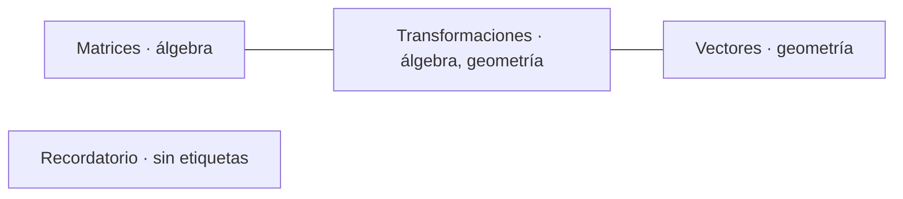

# Graph Notes

**Organiza tus apuntes y descubre cómo se relacionan mediante un grafo.**

Proyecto universitario, construido con HTML, CSS y JavaScript. Cada nota es un vértice y dos notas se conectan si comparten al menos una etiqueta.

## Funcionalidades

- Registro e inicio de sesión de demostración en el navegador.
- Crear, consultar, editar y eliminar notas de cada usuario local.
- Etiquetas separadas por comas, con sugerencias de etiquetas existentes.
- Grafo interactivo: zoom, arrastre y doble clic en un nodo para leer su nota.
- Notas con títulos repetidos, identificadas de manera independiente.
- Formularios con validación, navegación por teclado y lectura en un diálogo.

## Ejecutar localmente

Necesitas **Node.js 22 o posterior** y un navegador moderno. No hay dependencias npm ni paso de compilación.

```bash
git clone https://github.com/danielmanotas/graph-notes-mejorado.git
cd graph-notes-mejorado
npm start
```

Abre [http://localhost:8080](http://localhost:8080). Para detener el servidor, pulsa Ctrl+C.

También puedes servir la carpeta `Graph-Notes` con un servidor HTTP estático y abrir `html/login.html`. No abras los archivos con `file://`: la aplicación utiliza módulos de JavaScript.

El grafo carga **vis-network 4.21.0** y los iconos **Font Awesome 5.15.3** desde CDN; esas funciones requieren conexión a Internet. Si vis no carga, la gestión de notas sigue disponible y la vista del grafo muestra un mensaje.

## Uso

1. Registra un usuario de prueba e inicia sesión.
2. Abre el menú y selecciona **Crear Nota**.
3. Escribe un título, el contenido y etiquetas como `matemáticas, grafos`.
4. Crea otra nota que comparta alguna etiqueta.
5. Abre **Grafos** para explorar la relación, o **Ver Notas** para leer, editar o eliminar.

Las etiquetas vacías y repetidas se eliminan. Las mayúsculas se conservan: `Grafos` y `grafos` son etiquetas diferentes. Los títulos admiten hasta 100 caracteres y el contenido hasta 20 000.

## El modelo de grafos

El grafo es **no dirigido, simple y sin pesos**:

- **Vértice:** una nota, identificada por `seq`; el título solo es su etiqueta visual.
- **Arista:** dos notas del mismo usuario comparten una o más etiquetas.
- No se crean bucles ni varias aristas para la misma pareja.
- Las notas sin etiquetas se muestran como vértices aislados.

Ejemplo:



La construcción utiliza un índice `Map<etiqueta, notas>`: compara únicamente notas que comparten etiquetas. Con T asignaciones de etiquetas y kₜ notas por etiqueta, el trabajo es O(N + T + Σ kₜ²); un conjunto evita aristas duplicadas. En un grafo denso el costo sigue siendo cuadrático, porque el número de relaciones también lo es.

La simulación física se detiene al estabilizarse y la instancia del grafo se destruye al cambiar de vista.

## Estructura

```text
Graph-Notes/
├── assets/img/           # Icono del proyecto
├── css/                  # Estilos de formularios, notas y grafo
├── html/                 # Inicio de sesión, registro y aplicación
├── js/                   # Eventos de las páginas y navegación
└── modules/
    ├── notes.js          # Operaciones puras e índice de relaciones
    ├── Functions.js      # Persistencia, renderizado y vis.Network
    └── pages/pages.js    # Plantillas estáticas
scripts/serve.js          # Servidor local sin dependencias
test/notes.test.js        # Pruebas de regresión
.github/workflows/        # Pruebas automáticas en GitHub
```

## Datos y límites de la demostración

La aplicación no tiene backend. `localStorage` guarda `users` y `notas`; `sessionStorage` guarda el nombre del usuario activo en `username`.

**El registro no es autenticación segura:** las contraseñas del prototipo se almacenan en texto plano y quien tenga acceso al navegador puede consultar o modificar los datos. Utiliza credenciales ficticias y no guardes información sensible. La separación por usuario sirve para la demostración, no constituye control de acceso.

Los datos pertenecen al navegador y al origen (protocolo, host y puerto). No se sincronizan entre dispositivos; borrar los datos del sitio los elimina. Cambiar de puerto o pasar de GitHub Pages a localhost muestra otro almacenamiento.

Se mantiene el formato original de las notas:

```json
{
  "seq": 0,
  "user": "usuario-demo",
  "titulo": "Matrices",
  "contenido": "Apuntes sobre operaciones matriciales.",
  "etiquetas": ["álgebra"]
}
```

Los errores de JSON o de escritura se muestran sin reemplazar automáticamente los datos. Antes de restaurar datos dañados, conserva una copia de las claves originales. No se ofrece edición simultánea coordinada entre pestañas.

## Autoría y licencia

Creado por [Daniel Manotas](https://github.com/danielmanotas) como proyecto universitario. El repositorio no incluye una licencia de distribución del código propio. Las bibliotecas e iconos conservan sus licencias respectivas.
